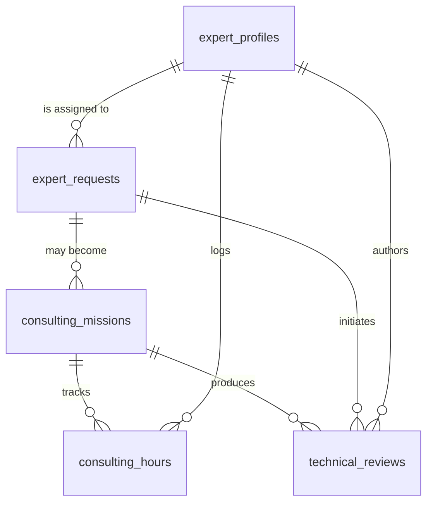

# AdminBTP - Architecture produit et socle expertise

## Positionnement produit

AdminBTP doit etre concu comme une plateforme hybride qui combine:

- un SaaS de gestion administrative BTP
- des automatisations IA
- des gestionnaires administratifs externalises
- un pole d'expertise technique humain

Le produit ne doit donc pas etre modele uniquement autour de dossiers, documents et workflows administratifs. Il doit aussi pouvoir exposer, tracer, vendre et facturer des prestations de conseil realisees par:

- un ingenieur BTP experimente
- un architecte HMONP
- d'autres experts a terme

## Axes fonctionnels a anticiper

Le socle de donnees doit permettre l'ajout progressif de services tels que:

- assistance technique chantier
- assistance reglementaire
- assistance architecturale
- assistance maitrise d'oeuvre
- assistance entreprise TCE
- assistance MOA

Ces services doivent pouvoir prendre plusieurs formes:

- ticket technique
- demande d'avis expert
- consultation ponctuelle
- mission de conseil au forfait
- mission de conseil au temps passe
- revue documentaire

## Principes de conception

1. Distinguer le besoin client, l'expert mobilise, la mission vendue et le temps consomme.
2. Permettre la monetisation sans imposer les ecrans V1.
3. Rattacher les demandes et missions a n'importe quel objet metier futur: client, projet, chantier, dossier, appel d'offres, document.
4. Conserver l'historique des avis, des revues et des arbitrages.
5. Prevoir des statuts explicites pour permettre automatisation, pilotage et facturation.

## Objets de donnees a creer des la V1

### `expert_profiles`
Reference les experts internes ou externes mobilisables.

Cas cibles:

- ingenieur BTP
- architecte HMONP
- futur consultant reglementaire
- expert MOEX/OPC

### `expert_requests`
Porte d'entree des sollicitations d'assistance.

Cas cibles:

- question technique chantier
- demande d'analyse DOE
- demande d'avis ERP/PMR
- assistance reponse appel d'offres
- demande de visa documentaire

### `consulting_missions`
Formalise la prestation vendue ou engagee.

Cas cibles:

- mission ponctuelle
- forfait mensuel
- accompagnement AOR
- audit technique

### `consulting_hours`
Trace le temps passe sur une mission pour pilotage, justification et facturation.

### `technical_reviews`
Archive les avis, analyses et revues produites.

Cas cibles:

- revue documentaire
- analyse EXE
- analyse PPSPS
- avis de conformite
- synthese de points de vigilance

## Relations metier recommandees

## Extensions a prevoir dans la future application

Le modele doit pouvoir etre relie plus tard a:

- `accounts` ou `organizations`
- `users`
- `projects`
- `construction_sites`
- `documents`
- `document_versions`
- `billing_invoices`
- `billing_line_items`
- `support_tickets`

## Decisions d'architecture

### 1. References externes souples

Comme le modele coeur n'existe pas encore, chaque table metier de conseil doit accepter des references externes generiques:

- `related_entity_type`
- `related_entity_id`

Cela permet de lier des objets de conseil a un projet, un chantier, un document ou un appel d'offres sans figer prematurement l'architecture.

### 2. Separation demande / mission / production

Une demande client n'est pas toujours une mission vendue, et une mission n'aboutit pas toujours a une unique note. La separation entre:

- `expert_requests`
- `consulting_missions`
- `technical_reviews`

evite de melanger le tunnel commercial, l'execution de service et le livrable d'expertise.

### 3. Orientation monetisation

Le socle doit permettre:

- tarification forfaitaire
- tarification horaire
- suivi de consommation d'heures
- preparation de facturation

### 4. Orientation IA + humain

Chaque demande et chaque revue doit pouvoir distinguer:

- origine humaine
- origine IA
- mode hybride

Cela permettra plus tard de tracer ce qui a ete prepare automatiquement puis valide par un expert.

## Priorites V1

Sans construire les interfaces des maintenant, la V1 doit au minimum permettre:

1. creation des tables de socle
2. statuts normalises
3. liaisons vers futurs objets metier
4. traces d'audit simples
5. champs de facturation de base

## Resultat attendu

Avec ce socle, AdminBTP pourra evoluer d'un simple outil administratif vers une plateforme de gestion administrative et d'accompagnement technique BTP, capable de vendre et operer des prestations d'expertise humaines appuyees par l'IA.
